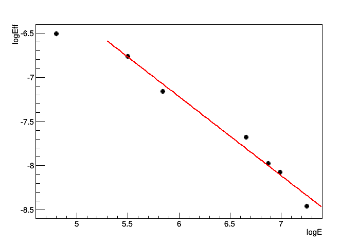

#Simulation for Ge Callibration
##Geometry

##Procedure
1.	Generate 106 **Eu152** to check the intensity of each peak  

			cd $MYG4SIMWORKROOT
			g4sim macros/CheckEu152.mac
			cd scripts/GeCallibration
			root -l get_ratio.C

	You will get:  

			Total events: 1e+06
			Events with RadioactiveDecay Gamma Ray: 991841
			Peak[0]: 121.78+-0.1% keV, 0.282435
			Peak[1]: 244.7+-0.1% keV, 0.076972
			Peak[2]: 344.27+-0.1% keV, 0.266054
			Peak[3]: 778.9+-0.1% keV, 0.129626
			Peak[4]: 964.01+-0.1% keV, 0.14723
			Peak[5]: 1085.78+-0.1% keV, 0.102016
			Peak[6]: 1407.95+-0.1% keV, 0.210716
			Events with Gamma from Peaks: 1.21505e+06

	Where the last number of each peak line is the ratio of that peak,
	which is defined as Ratio = Npeak/NEu152.

2.	Generate 7x106 **Eu152** from source position and record Ge response.
	Check the efficiency of each peak with given ratios (got from #1, written into `get_eff.C`)

			cd $MYG4SIMWORKROOT
			bg4sim_sub -t sim -b 0 -e 6 -Y GeCallibration GeCallibration001
			cd scripts/Callibration
			root -l get_eff.C
	
	You will get:  

			Total events: 7e+06
			Peak[0]: 121.78+-1.64231% keV, Efficiency: 0.0014896
			Peak[1]: 244.7+-0.817327% keV, Efficiency: 0.00115812
			Peak[2]: 344.27+-0.580939% keV, Efficiency: 0.000778574
			Peak[3]: 778.9+-0.256772% keV, Efficiency: 0.000463972
			Peak[4]: 964.01+-0.207467% keV, Efficiency: 0.000343486
			Peak[5]: 1085.78+-0.184199% keV, Efficiency: 0.000312276
			Peak[6]: 1407.95+-0.14205% keV, Efficiency: 0.000212202
			logE		logEff
			4.80222		-6.50925
			5.50003		-6.76096
			5.84143		-7.15805
			6.65788		-7.67569
			6.8711		-7.97636
			6.99005		-8.07162
			7.24989		-8.45797

##Result:	
**Eu152** decay in Geant4 is based on `G4RadioactiveDeacy`. Peaks can be seen below:  
  
Ge response (energy deposition inside Ge):  
  
If we fit log(Eff) VS log(E):  
  
Here the slope is `-0.895787 +/- 0.0647644`, constant is `-1.84435 +/- 0.42414`

##Comparison with [Elog665](https://muon.npl.washington.edu/elog/mu2e/RunPSI2013/665)  
Slope:   -0.895787  VS  -0.8807,  1.7% smaller, meaning that they have almost the same description of Ge detector performance.  
Constant: -1.84435 VS -2.784,  larger by 0.94, meaning that efficiency in MC is larger than callibration result by a factor of e0.94=2.56.  
