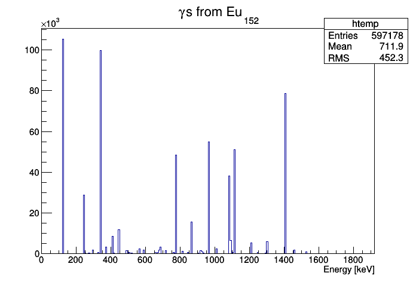
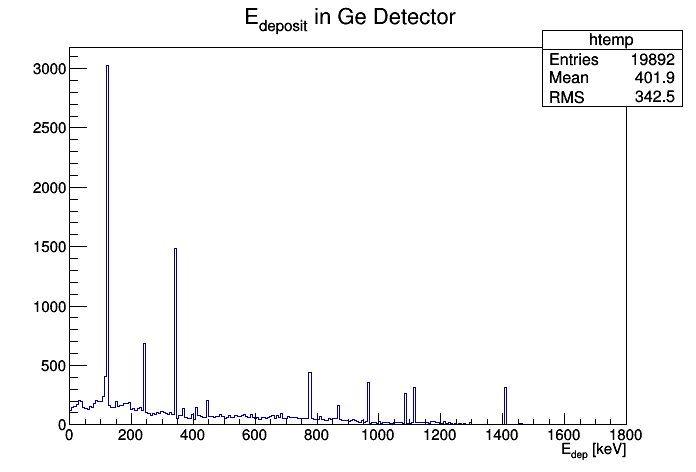
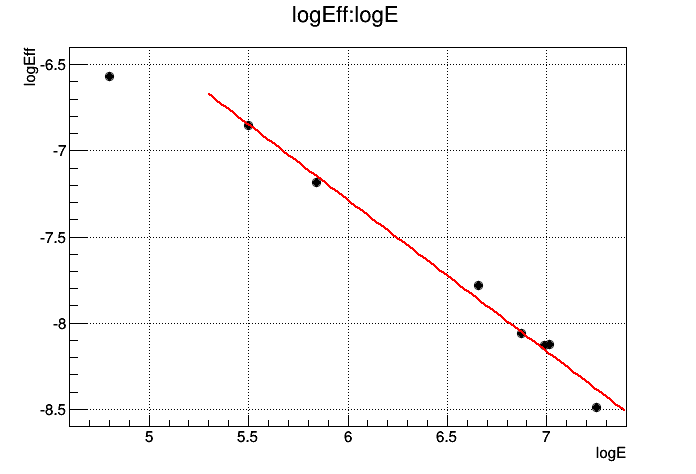
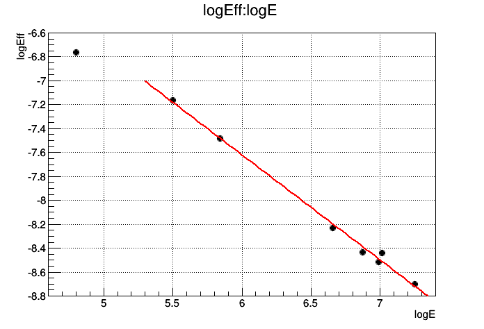
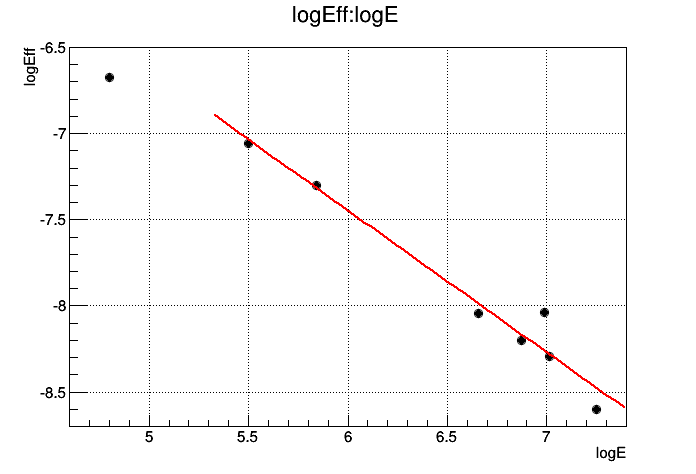

#Simulation for Ge Callibration
##Geometry

Here three versions of geometries have been used:

1.	The same geomtry as last time,
where the distance from the front end of Ge detector to the target is set to 30 cm,
and the flange before Ge detector is 5 mm thick Aluminum.  
2.	distance = 35 cm, thickness = 5 mm.  
3.	distance = 30 cm, thickness = 10 mm.  

##Procedure
1.	Generate 106 **Eu152** to find peaks and check the ratio of each peak  

			cd $MYG4SIMWORKROOT
			g4sim macros/CheckEu152.mac
			cd scripts/GeCallibration
			root -l get_peaks.C

	You will get:  

			Total events: 1000000
			Events with RadioactiveDecay Gamma Ray: 991841
			Peaks with ratio over 5%: (error +-0.025keV)
				Index	Energy		Ratio
				     	keV   		Ngam/Nevents
				0	121.775		0.282415
				1	244.675		0.076972
				2	344.275		0.265659
				3	778.925		0.129626
				4	964.075		0.14587
				5	1085.875		0.101973
				6	1112.075		0.136631
				7	1407.975		0.210716
			Gammas from all peaks: 1594107
			Gammas from highest 8 peaks: 1349862

	Where the last number of each peak line is the ratio of that peak,
	which is defined as Ratio = Npeak/NEu152.

2.	Generate 7x106 **Eu152** from source position and record Ge response.
	Check the efficiency of each peak with given ratios (got from #1, written into `get_eff.C`)

	**Option 1:** distance = 30 cm; thickness = 5 mm  

			cd $MYG4SIMWORKROOT
			bg4sim_sub -t sim -b 0 -e 6 -Y GeCallibration GeCallibration001
			cd scripts/Callibration
			root -l get_eff.C

	You will get:  

			Total events: 7e+06
			Peak[0]: 121.775+-0.0205297% keV, Efficiency: 0.00140017
			Peak[1]: 244.675+-0.0102176% keV, Efficiency: 0.00105604
			Peak[2]: 344.275+-0.00726164% keV, Efficiency: 0.000757685
			Peak[3]: 778.925+-0.00320955% keV, Efficiency: 0.000416583
			Peak[4]: 964.075+-0.00259316% keV, Efficiency: 0.000315349
			Peak[5]: 1085.88+-0.00230229% keV, Efficiency: 0.000294196
			Peak[6]: 1112.08+-0.00224805% keV, Efficiency: 0.000295896
			Peak[7]: 1407.97+-0.0017756% keV, Efficiency: 0.0002061
			logE			logEff
			4.80218			-6.57116
			5.49993			-6.85323
			5.84144			-7.18524
			6.65791			-7.78342
			6.87117			-8.06183
			6.99014			-8.13127
			7.01398			-8.1255
			7.24991			-8.48715

	**Option 2:** 	distance = 35 cm; thickness = 5 mm  

	You will get:  

			Total events: 7e+06
			Peak[0]: 121.775+-0.0205297% keV, Efficiency: 0.00115484
			Peak[1]: 244.675+-0.0102176% keV, Efficiency: 0.000773936
			Peak[2]: 344.275+-0.00726164% keV, Efficiency: 0.000561407
			Peak[3]: 778.925+-0.00320955% keV, Efficiency: 0.000266701
			Peak[4]: 964.075+-0.00259316% keV, Efficiency: 0.000217415
			Peak[5]: 1085.88+-0.00230229% keV, Efficiency: 0.000200333
			Peak[6]: 1112.08+-0.00224805% keV, Efficiency: 0.000216433
			Peak[7]: 1407.97+-0.0017756% keV, Efficiency: 0.0001661
			logE			logEff
			4.80218			-6.7638
			5.49993			-7.16402
			5.84144			-7.48506
			6.65791			-8.22938
			6.87117			-8.4337
			6.99014			-8.51553
			7.01398			-8.43823
			7.24991			-8.70292

	**Option 3:** 	distance = 30 cm; thickness = 10 mm  

	You will get:  

			Total events: 7e+06
			Peak[0]: 121.775+-0.0205297% keV, Efficiency: 0.00126106
			Peak[1]: 244.675+-0.0102176% keV, Efficiency: 0.000861167
			Peak[2]: 344.275+-0.00726164% keV, Efficiency: 0.000676485
			Peak[3]: 778.925+-0.00320955% keV, Efficiency: 0.000320703
			Peak[4]: 964.075+-0.00259316% keV, Efficiency: 0.000275196
			Peak[5]: 1085.88+-0.00230229% keV, Efficiency: 0.000323615
			Peak[6]: 1112.08+-0.00224805% keV, Efficiency: 0.000249891
			Peak[7]: 1407.97+-0.0017756% keV, Efficiency: 0.000184405
			logE			logEff
			4.80218			-6.6758
			5.49993			-7.05722
			5.84144			-7.2986
			6.65791			-8.045
			6.87117			-8.19803
			6.99014			-8.03596
			7.01398			-8.29449
			7.24991			-8.59837

##Result:	
**Eu152** decay in Geant4 is based on `G4RadioactiveDeacy`. Peaks can be seen below:  
  
Ge response (energy deposition inside Ge) in **option 1**:  
  
If we fit log(Eff) VS log(E), for **option 1**:  
  
Here the slope is `-0.877724   +/-   0.0410669`, constant is `-2.02044   +/-   0.271757`  
for **option 2**:  
  
Here the slope is `-0.878572   +/-   0.0273766`, constant is `-2.34931   +/-   0.181163`  
for **option 3**:  
  
Here the slope is `-0.822675   +/-   0.0740088`, constant is `-2.51174   +/-   0.489747`  

##Comparison with [CW_140615](CW_140615.md)  
1.	**Option 1:**  
Slope gets larger: because the efficiency of small energy peaks were over estimated by counting in backgrounds in CW_140615.  
Constant gets smaller: Same reason.  
In CW_140615 I was counting hits within peak+-2keV region while didn't subtract the background.  
This time I narrowed the window to 0.025keV, which is still much larger than the peak width but exluding most background hits.

##Comparison with [Elog665](https://muon.npl.washington.edu/elog/mu2e/RunPSI2013/665)  
1.	**Option 1:**  
Slope:   -0.877724  VS  -0.8807,  0.3% larger, meaning that they have almost the same description of Ge detector performance.  
Constant: -2.02044 VS -2.784,  larger by 0.76, meaning that efficiency in MC is larger than callibration result by a factor of e0.76=2.14.  
2.	**Option 2:**  
Slope remains similar while constant gets smaller.
Only difference from **option 1** is geometrical acceptance.
3.	**Option 3:**  
Slope changed, while the error of fitting also increased. Probably because that the 10 mm thick flange distorted the curve.
Constant gets smaller.
